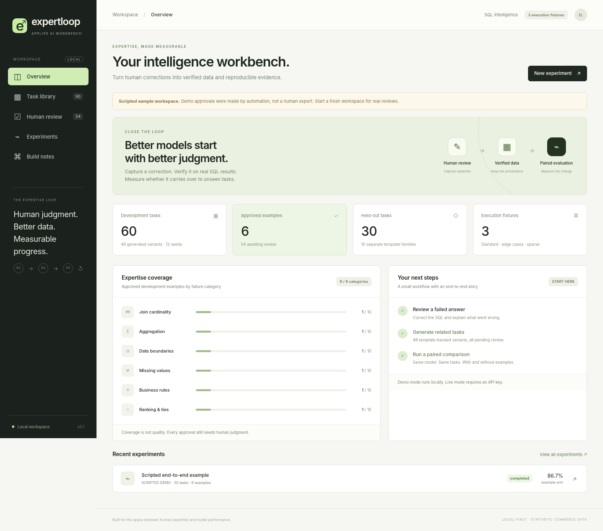

# ExpertLoop

**Human corrections → verified SQL datasets → reproducible model evaluations.**

A small, runnable Applied AI portfolio project. Review a faulty answer, capture the correction, generate related tasks, and compare a baseline with an approved-example prompt on a held-out evaluation.

**Demo mode is scripted. It does not demonstrate real model improvement.** The optional live adapter makes genuine model calls; the two modes are labeled separately throughout the interface and reports. No fine-tuning is included.



## Start locally

Requires Python 3.11 or later. This build was tested on Python 3.13.5.

```bash
cd expertloop
python3 -m venv .venv
source .venv/bin/activate
python -m pip install -e ".[dev]"
python -m expertloop serve
```

Open **http://127.0.0.1:8000**. The first startup creates fictional database fixtures and the initial task catalog. No API key is needed for the scripted demo. No Node.js, frontend build, separate database server, or external asset CDN is required.

On Windows PowerShell, create and activate the environment with:

```powershell
py -3 -m venv .venv
.\.venv\Scripts\Activate.ps1
python -m pip install -e ".[dev]"
python -m expertloop serve
```

An alternative without installing the project as a package, from the repository root:

```bash
python -m pip install -r requirements.txt
python -m expertloop serve
```

The app is intentionally local and single-user. Keep the default loopback host. Do not run multiple Uvicorn workers against the same workspace.

## Your first real review

1. Open **Human review** and select the monthly-revenue seed. Its scripted candidate multiplies order totals through a one-to-many join.
2. Correct the SQL, enter your name and explanation, click **Validate on 3 fixtures**, then **Approve correction**. “Use reference” provides a starting point, not a substitute for reading the task and checking its meaning.
3. Generate variants in **Task library**, then start a **New experiment**. Choose **Scripted demo** to exercise the pipeline without API calls.

Approve examples in several categories to exercise the category-diverse example selection. Inspect individual failed outputs, not only aggregate accuracy. The original reference, approved correction, and review history remain separate.

The default workspace starts with **12 development seeds, 30 holdout tasks, and zero approvals**. Generation adds **48 development variants**, all pending review, for 90 tasks total. Generating again skips duplicate IDs.

## What is implemented

| Area | Working behavior |
|---|---|
| Task library | Search, category/state filters, development/holdout separation, source and parent IDs |
| Synthetic data | Deterministic template variants with reference checks on three fixtures |
| Human review | Editable SQL, fixture comparison, approve/reject/reopen, reviewer notes and revision audit |
| Correctness | Result-table comparison; duplicate-, NULL-, order- and numeric-tolerance-aware |
| Evaluation | Baseline versus a fixed snapshot of approved development examples |
| Inference | Offline scripted provider and optional OpenAI Responses adapter |
| Operations | Bounded concurrency, retries, per-run request caps, pause/resume, committed-result deduplication |
| Statistics | Category breakdown, paired wins/regressions, 95% family-cluster bootstrap interval |
| Provenance | Dataset/example/prompt hashes, full run snapshots, fixture hashes, returned model IDs |
| Export | Approved-only SFT-format JSONL, provenance JSONL, Markdown reports, complete JSON artifacts |
| Packaging | Single-service UI/API, tests, container files, CI configuration, interview-demo notes |

This implementation uses **FastAPI + SQLite + a bundled HTML/CSS/JavaScript interface**. It intentionally simplifies the earlier DuckDB/Streamlit sketch so the MVP has one process and fewer installation requirements.

## Replay the complete scripted example

```bash
python -m expertloop demo
python -m expertloop serve --data-dir state/demo
```

The CLI explicitly inserts **automated demo approvals**, generates the variants, and runs both arms on the 30 holdout tasks. It labels the actor `SCRIPTED_DEMO_NOT_HUMAN` and writes the report/artifact under `reports/demo/`.

These automated approvals are **not independent human validation**. This command uses `state/demo`, separate from the normal workspace. Start the normal app without `--data-dir state/demo` for genuine manual reviews.

A generated sample is included at [docs/sample-run/report.md](docs/sample-run/report.md). Its percentages are intentionally simulated

## Run a live model experiment

Create a `.env` file in the repository root:

```dotenv
OPENAI_API_KEY=your-api-key
OPENAI_MODEL=your-responses-compatible-model-id
```

Replace both placeholders. Choose a model your account can access that supports the Responses API and strict JSON-schema structured output. The repository does not hard-code a “latest” model or pricing assumption.

Restart the app:

```bash
python -m expertloop serve
```

Approve genuine development examples, open **New experiment**, select **OpenAI · live model**, and review the model ID and inference controls before starting.

**Live calls may incur charges.** The request cap counts attempts, including retries. The output-token cap applies per request. Neither is a precise dollar budget. A timed-out or interrupted request may be billed even if its response/usage was not recorded. Keep provider-side spending limits appropriate for your account.

\


## Tests

```bash
python -m pytest
```

The suite covers the SQL allowlist, read-only restrictions, resource/row limits, reference and mutation checks, split isolation, duplicate suppression, review audits, stale-revision protection, exports, frozen snapshots, paired statistics, API write guards, provider parsing/retries, atomic request budgeting, and resume behavior.

Optional browser interaction checks:

```bash
python -m pip install playwright==1.57.0
python -m playwright install chromium
python scripts/browser_smoke.py
```

A system Chromium executable can be selected with `--chromium /path/to/chromium`. This smoke test renders the bundled source in memory and connects it to a real FastAPI `TestClient`; it does not test TLS, a reverse proxy, or public browser networking. See [docs/TESTING.md](docs/TESTING.md) for what was actually verified.

## Docker

```bash
docker compose up --build
```

## Useful commands and endpoints

```bash
# Fresh workspace without deleting existing work
python -m expertloop serve --data-dir state/my-experiment --port 8001

# Initialize data without launching a server
python -m expertloop init

# Export approved examples, with reviewer and parent provenance
curl 'http://127.0.0.1:8000/api/export?format=provenance' -o approved.jsonl

# Create a scripted evaluation through the API
curl -X POST http://127.0.0.1:8000/api/runs \
  -H 'Content-Type: application/json' -H 'X-ExpertLoop: 1' \
  -d '{"name":"API demo","provider":"demo","split":"holdout"}'
```

## Repository map

```text
expertloop/
  app.py             FastAPI routes, lifecycle, local write/host guards
  service.py         Review, generation, exports, and evaluation coordination
  store.py           SQLite metadata and append-only review events
  catalog.py         12 development + 10 holdout task families
  fixtures.py        Deterministic fictional databases and business rules
  sql_worker.py      Restricted stdlib-only SQL child process
  evaluator.py       Candidate execution and result comparison
  providers.py       Scripted demo + live Responses adapter
  stats.py           Family-cluster paired bootstrap
  cli.py             Serve / initialize / replay demo commands
  static/            Bundled interface, no frontend build
scripts/
  browser_smoke.py   Browser interaction checks against the real API
tests/              Unit and API integration tests
docs/               Architecture, security, demo notes, screenshots, sample run
```

## Know the boundaries before presenting it

The references and questions are synthetic/template-derived, not independently expert-certified. Fixture agreement is evidence, not a proof of SQL equivalence. Ten holdout families are too few for broad claims about professional model capability. Repeatedly inspecting and tuning against a holdout can invalidate the “unseen” claim even when code keeps the splits separate.

The approved-example arm uses **few-shot prompting, not model training**. A first meaningful extension is a real domain-expert review session and a live comparison on a newly designed final holdout. Fine-tuning can come after that baseline is established.

The SQL worker is restricted but is not a production multi-tenant OS sandbox. The app has no login, tenancy, distributed queue, worker leases, or production monitoring. Exactly-once storage does not imply exactly-once external API billing after a crash. Read [SECURITY.md](docs/SECURITY.md) and [ARCHITECTURE.md](docs/ARCHITECTURE.md).


